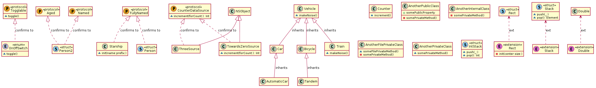

# Swift to PlantUML

Using SourceKitten and PlantUML to generate UML class diagrams from swift source code.




## Usage


`sh plantuml.sh demo.swift`

If you want to run on multiple files at the moment, you can do some command line kung fu like below

`ls -d "/directory/full/of/swift/files/"* | xargs -L 1 sh plantuml.sh  | pbcopy`

or if you list of files with fullpath

`cat ~/Downloads/listOfFilesWithFullPath.txt | xargs -L 1 | xargs -L 1 sh plantuml.sh | pbcopy`

once it copy everything to your clipboard (MacOS) you can paste it in your favorite text editor replace multiple `@startuml` and `@enduml` block and have just one _startuml_ at top and _enduml_ at the bottom

---

`sh plantuml.sh demo.swift`

will produce this diagram [Full Image](http://www.plantuml.com/plantuml/svg/dLRRQXiz4BxVfn2v-RtyYIyCRM498KxYb4BgcAmfj3T5rewzgdLO96qJzz1dxwu6sR8N7z8RCuTllj6CHhDEhgsZnjLI9F-HVFhvOTJy3f-cISaB820hjo8Iv0oCJUoIgueQAeajQQ6VkLgGEHKMrg6ZyLt21BMMdDtNGgp6L49nHgWb6vLSNfBUvFoz5WMe9rsaf3BQQQO5kReYFvFaTw2OwiL2q9a0px3MZX4GyiUrMEYb4TdcAAyynN016DSAfuVTwbevC7VKqLpNXc4H7Ui9nN3534XGhZVNnXDaQKO-A1Tb-mGbPm9pe0mOBEaInfhRxMRSSBOAS9HXk_DK5I2z6yLjhw5SeREL3YMwfGRhfcQxgRNJaZhE0c1js4NcZXfRyigZWX8QmrrFKGbPPM3ENxAqs_-uwxljZE7JqW145nNfEpFvJ4rXlu3H4RfZFVtcXagx4ioadecc-DRc6RjcJ_c_rHBGE36w0kDMZVN2Mmt_JXry15VgefTsKpHvmIWgeYGT1wOvaV2UYm3QuUpwi24jRV34rATct9Ujc-amtHCmv-DRmJ_1_9paozMDg24brfcQkTq7FG5ZDOuzYg-A6qI1WnCZctl97MLB7ngK_R5OU5NRilSrIxsigrvdu3QK_yet4Y1XY_DHFSxd-JDthFJCaUxvH-SFV54s1G08p0AgbeVMzPskm-97SV2689CshEH5m_3YG5ck5TBikTp1smDXEEj-ZJ1G3anc-G_8qltT6hmxUeeaBDIB-kBNrNeRPuIh4WntDi6LIj0Vq94Vj-hUy5jgzZkZFHfGZHGZrZkqN_SRR_HXpWZJQiwDjCJf9Dw0I3JE7sVVW3aI-v2c-s7ROUjko0vd1t4QCxwfOzM4buUmuuZXeWE8Xnf1wxyaEqYSM7BPxs-6Dsj79Mb7ihM7sKIh7orl3aE6zcjGHIr5alm5)

Generates the below content, which you can copy and paste it in [PlantText](https://www.planttext.com/api/plantuml/png/d5RDRjim3BxxAOHUbc1D3W6s0KPHD6tJeK2N1dKmOBiCYip4McJ9aEIrsT-BxR17sYjCbkn4jfV4tIMWo8yVJOgaykVNx-12QInrdhBW1Ohc7-ucvdVyC0yI6WE2DDCRb4Aw0Aa2jQOymnAdI2Ku5e-Khz0ICmLRrydqEY0CAuLERdB6DbESGdo2i4Ax8pexGxtPwLl1Ok0F8kwZJ0ejY63e_1nz2u8V5SLSh5OCBnXOXktf6052FtM1XLxV8zjzoZE_Ohmg_GgXkzkLoBa6UOqrZaGkYKkYfUsG3EL4GWfSzvP2MeAm7w9Rhhrexo6Xf2nKAJld5AzXAgYg5-EIaaq5B-LwvJ6F8NLbjsBTAZ7bpbX8Xm9TOUdonh9Ur5oB56jAAe2lg24ZqvugePb5LOUgC5JtkBdDC9Emf4zXlrr_l-hDSlhmUI81l8lopesUVCGoLXz12X_Tr7Q_kJ4NEW4vonVC95_eN3rQQalvKeaKd78cHGPIRunsOBMIVi4Qte5EH5pBhUIwBMh0CMi5gHbic6w4DvHLe1Pdq-OAKj1wbYrrruZxelqxqdww1o3Q-XU27S7e54NhpINBeO-KbhbHDmPwPbQWS6tln6VvZJp7KKTFSo-cuSdQkbQ7WxucyInNIUzJsBUoo7gjXjjH_Y_VXDcczZZl-Vro6JrIJHBBx9qj_-JqZguIam00Sr60v-cXTNqjychnEt7qgcGIafYtoJ0yQU2AcdjebArskQFNXzrCvzarGg0OWb3Hhr1R8urgZTuS_OgWMgY3VF3zVBkDGqIvwLIgLL2kL6UlqBxTRjMzxiM6t6kixL67AYGFiTsXmtnehDx3728Y-9BAL24j0dy3Eg9fTB_uN0nCpUPesWzRWwsr8LkSBKGtvd8OZsHJJPw37KVOnxuEy9lQWNP_IUf8rx7eR3ZSDMzOj4hWzetHbxtfjEKW6dNLP4v_0Jmk_fa5Vm400F__0m00)

```


@startuml
' STYLE START
hide empty members
skinparam shadowing false
' STYLE END
class "FullyNamed" as FullyNamed << (P,GoldenRod) protocol >> {

}
class "Togglable" as Togglable << (P,GoldenRod) protocol >> {
  ~toggle()

}
class "Named" as Named << (P,GoldenRod) protocol >> {

}
class "Aged" as Aged << (P,GoldenRod) protocol >> {

}
class "CounterDataSource" as CounterDataSource << (P,GoldenRod) protocol >> {
  ~increment(forCount:): Int

}
class "Vehicle" as Vehicle {
  ~makeNoise()

}
class "Bicycle" as Bicycle {

}
class "Tandem" as Tandem {

}
class "Train" as Train {
  ~makeNoise()

}
class "Car" as Car {

}
class "AutomaticCar" as AutomaticCar {

}
class "Starship" as Starship {
  ~init(name:prefix:)

}
class "Counter" as Counter {
  ~increment()

}
class "ThreeSource" as ThreeSource {

}
class "TowardsZeroSource" as TowardsZeroSource {
  ~increment(forCount:): Int

}
class "AnotherPublicClass" as AnotherPublicClass {
  +somePublicProperty
  -somePrivateMethod()

}
class "AnotherInternalClass" as AnotherInternalClass {
  -somePrivateMethod()

}
class "AnotherFilePrivateClass" as AnotherFilePrivateClass {
  ~someFilePrivateMethod()
  -somePrivateMethod()

}
class "AnotherPrivateClass" as AnotherPrivateClass {
  ~somePrivateMethod()

}
class "Rect" as Rect << (S, SkyBlue) struct >> {

}
class "Person" as Person << (S, SkyBlue) struct >> {

}
class "Person2" as Person2 << (S, SkyBlue) struct >> {

}
class "IntStack" as IntStack << (S, SkyBlue) struct >> {
  ~push(_:)
  ~pop(): Int

}
class "Stack" as Stack << (S, SkyBlue) struct >> {
  ~push(_:)
  ~pop(): Element

}
class "OnOffSwitch" as OnOffSwitch << (E,LightSteelBlue) enum >> {
  ~toggle()

}
class "Double" as Double25 << (E,orchid) extension >> {

}
class "Rect" as Rect26 << (E,orchid) extension >> {
  -init(center:size:)

}
class "Stack" as Stack27 << (E,orchid) extension >> {

}

Bicycle -u-|> Vehicle : inherits
Tandem -u-|> Bicycle : inherits
Train -u-|> Vehicle : inherits
Car -u-|> Vehicle : inherits
AutomaticCar -u-|> Car : inherits
Starship .u.|> FullyNamed : confirms to
ThreeSource -u-|> NSObject 
ThreeSource .u.|> CounterDataSource : confirms to
TowardsZeroSource -u-|> NSObject 
TowardsZeroSource .u.|> CounterDataSource : confirms to
Person .u.|> FullyNamed : confirms to
Person2 .u.|> Named : confirms to
Person2 .u.|> Aged : confirms to
OnOffSwitch .u.|> Togglable : confirms to
Double <.. Double25 : ext
Rect <.. Rect26 : ext
Stack <.. Stack27 : ext
@enduml


```

## Dependencies


* [SourceKitten](https://github.com/jpsim/SourceKitten)
* [jq](https://github.com/stedolan/jq)
* [NodeJS](https://nodejs.org/en/)


* Generates output for [PlantText*](https://www.planttext.com/)
